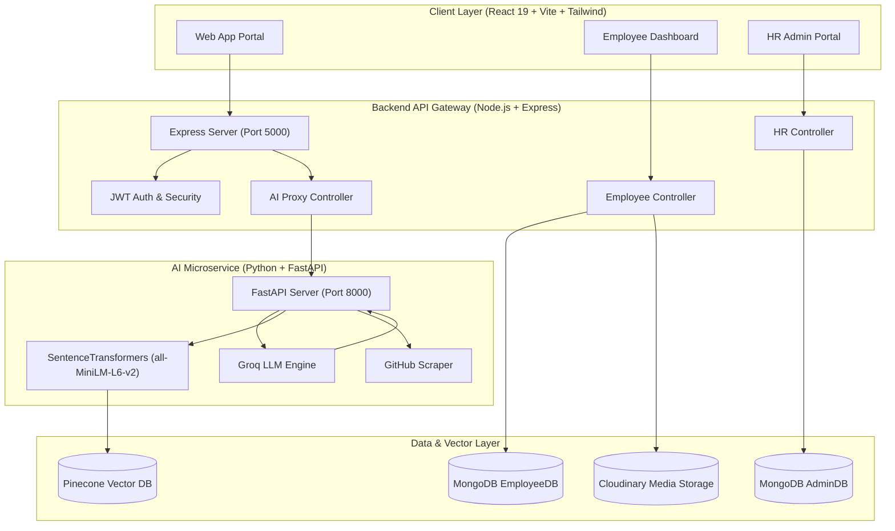
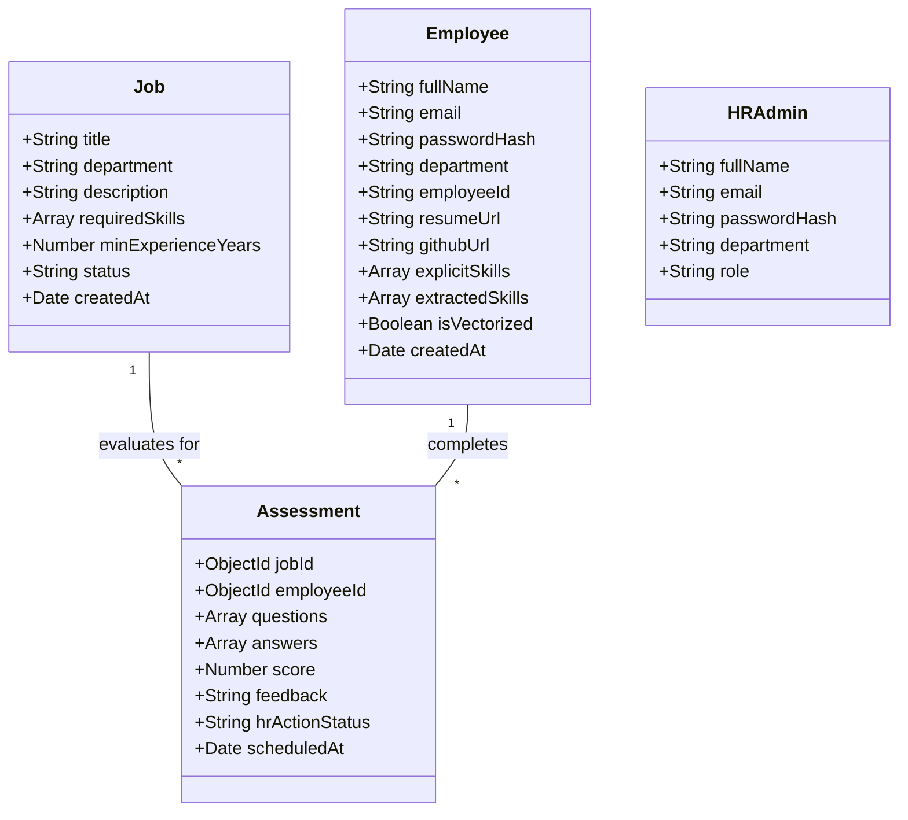

# 🚀 Talent Utilization & Mobility Portal 

> **An Enterprise AI-Powered Workforce Mobility & Skill-Intelligence Platform**

The **Talent Utilization & Mobility Portal** (SkillSphere) is an intelligent end-to-end enterprise solution designed to solve the talent discovery and internal mobility challenge. By unifying employee data—resumes, work history, GitHub activity, certifications, and assessment performance—the platform builds dynamic, evidence-backed skill profiles. 

Leveraging cutting-edge AI (Groq LLM, SentenceTransformers, Pinecone Vector DB), the system exposes hidden and transferable skills, matches employees to internal jobs and gig projects, generates personalized 6-month skill-gap roadmaps, and provides HR teams with real-time workforce mobility analytics.

---

## 📋 Table of Contents

- [✨ Key Features](#-key-features)
  - [🤖 AI Engine & Intelligence](#-ai-engine--intelligence)
  - [👤 Employee Portal](#-employee-portal)
  - [🛡️ HR Admin Portal](#️-hr-admin-portal)
- [🏗️ System Architecture](#️-system-architecture)
- [🛠️ Tech Stack](#️-tech-stack)
- [📂 Repository Structure](#-repository-structure)
- [🚀 Quick Start & Setup](#-quick-start--setup)
  - [Prerequisites](#prerequisites)
  - [1. Backend Setup](#1-backend-setup-nodejs--express)
  - [2. AI Microservice Setup](#2-ai-microservice-setup-python--fastapi)
  - [3. Frontend Setup](#3-frontend-setup-react--vite)
- [🔑 Environment Variables](#-environment-variables)
- [📡 API Reference](#-api-reference)
  - [Node.js Backend Gateway (`http://localhost:5000`)](#nodejs-backend-gateway-httplocalhost5000)
  - [Python AI Microservice (`http://localhost:8000`)](#python-ai-microservice-httplocalhost8000)
- [🗄️ Database Architecture & Schemas](#️-database-architecture--schemas)
- [🧪 Testing & Quality Assurance](#-testing--quality-assurance)
- [👥 Team & Branching Strategy](#-team--branching-strategy)
- [📄 License](#-license)

---

## ✨ Key Features

### 🤖 AI Engine & Intelligence
- **Intelligent Resume Parsing**: Extracts structured skills, work history, projects, and certifications from uploaded PDF/DOCX resumes using Groq LLM (`Llama 3 70B/8B`).
- **Semantic Vector Matching**: Generates 384-dimensional embeddings via `SentenceTransformers (all-MiniLM-L6-v2)` and queries Pinecone vector database for high-precision employee-to-job matching.
- **Dynamic Skill-Gap Analysis & Roadmaps**: Calculates missing skills for target roles and generates customized step-by-step 6-month career development roadmaps.
- **GitHub Skill Harvesting**: Scrapes developer GitHub profiles to analyze repositories, star counts, and dominant languages, dynamically expanding skill profiles.
- **Context-Aware AI Career Coach**: Interactive career chat assistant pre-loaded with the employee's skill matrix and target career goals.
- **Automated Assessment Evaluation**: AI generates job-specific quiz questions and automatically grades candidate submissions with qualitative feedback.

### 👤 Employee Portal
- **Interactive Dashboard**: View overall fit score, matched internal openings (Fit Score $\ge$ 70%), unfit/development openings, and profile completeness metrics.
- **Profile Management**: Upload resumes directly to Cloudinary, edit background experience, and manage GitHub integrations.
- **Target Role Roadmap**: Explore target jobs and visualize clear learning pathways to bridge identified skill gaps.
- **Interactive Assessments**: Participate in timed, skill-verification tests and view detailed evaluation feedback upon HR review.

### 🛡️ HR Admin Portal
- **Workforce Analytics**: Monitor organizational skill distributions, department mobility pipelines, and skill gap heatmaps.
- **Job Opening Management**: Create, edit, activate, or deactivate internal postings with rich skill requirements.
- **Candidate Fit Matching**: View rank-ordered candidates for any job opening based on AI semantic match scores.
- **Assessment Management**: Schedule tailored assessments for candidates, evaluate AI-graded responses, and trigger administrative actions (Promote, Schedule Interview, Archive).

---

## 🏗️ System Architecture



---

## 🛠️ Tech Stack

| Layer | Technology / Library | Description |
| :--- | :--- | :--- |
| **Frontend UI** | React 19, Vite 8, React Router v7 | Responsive single-page web app with fast HMR |
| **Styling & Linting** | Tailwind CSS v4, Oxlint | Modern UI design system with ultrafast linting |
| **Backend API Gateway** | Node.js, Express.js (CommonJS) | RESTful API managing business logic & auth |
| **Database System** | MongoDB, Mongoose | **Dual DB**: `EmployeeDB` (private) + `AdminDB` (shared HR) |
| **AI Microservice** | Python 3.10+, FastAPI, Uvicorn | High-performance async microservice for AI workloads |
| **LLM Inference** | Groq API (`Llama 3 70B/8B`) | High-speed LLM processing for parsing, gaps, and chat |
| **Vector Store** | Pinecone (`skillsphere-employees`) | Serverless vector database (384d, Cosine Metric) |
| **Embeddings Model** | SentenceTransformers (`all-MiniLM-L6-v2`) | Local HuggingFace embedding model (~80 MB) |
| **Media & File Storage** | Cloudinary, Multer | Cloud storage for streaming PDF/DOCX resume files |
| **Auth & Security** | JWT, Bcrypt.js, Express-Validator | Secure authentication, password hashing, input checks |
| **Testing** | Jest, Supertest, Pytest | Comprehensive unit, integration, and e2e test suites |

---

## 📂 Repository Structure

```
Talent-Utilization-Mobility-Portal/
├── 📄 README.md                                  # Comprehensive System Documentation
├── 📄 LICENSE                                    # License Agreement
├── 📄 .gitignore                                 # Git Ignore Definitions
│
├── 🤖 Talent-Utilization-Mobility-Portal-ai/     # Python FastAPI AI Microservice
│   ├── 📁 app/
│   │   ├── 📄 main.py                           # FastAPI App Entrypoint & Router Mounts
│   │   ├── 📄 config.py                         # Environment Config & Lazy Client Inits
│   │   ├── 📁 routers/                          # API Endpoints (resume, matching, assessment, chat, github)
│   │   ├── 📁 services/                         # Pinecone Vector Store Integration
│   │   └── 📁 schemas/                          # Pydantic Input/Output Schemas
│   ├── 📄 run.py                                # Uvicorn Launcher Script
│   ├── 📄 test_ai_live.py                       # Live AI Service Integration Verification
│   ├── 📄 requirements.txt                      # Python Dependencies
│   ├── 📄 .env.example                          # AI Environment Variable Template
│   └── 📄 .env                                  # Active AI Configuration
│
├── 🔧 Talent-Utilization-Mobility-Portal-backend/# Node.js Express API Server
│   ├── 📄 server.js                             # Express App Entrypoint & Middleware Bootstrap
│   ├── 📁 src/
│   │   ├── 📁 config/                           # Dual Database & Cloudinary Connection Managers
│   │   ├── 📁 controllers/                      # Business Logic (Employee, HR, AI Proxy)
│   │   ├── 📁 middleware/                       # JWT Authentication & Multer Upload Handlers
│   │   ├── 📁 models/                           # Mongoose Models (Employee, Job, Assessment, HRAdmin)
│   │   ├── 📁 routes/                           # Express Route Definitions (employee, hr, ai)
│   │   └── 📁 tests/                            # Jest Unit & Integration Test Suites
│   ├── 📁 scripts/                              # Seeding Scripts (seed.js for mock DB population)
│   ├── 📄 package.json                          # Node.js Project Manifest & Scripts
│   ├── 📄 .env.example                          # Backend Environment Variable Template
│   └── 📄 .env                                  # Active Backend Configuration
│
└── 🖥️ Talent-Utilization-Mobility-Portal-frontend/# React 19 + Vite Web Application
    ├── 📁 src/
    │   ├── 📄 App.jsx                           # Application Router & Protected Route Gates
    │   ├── 📄 main.jsx                          # React DOM Mount Entrypoint
    │   ├── 📁 components/                       # Shared Layout, Guard, AppShell Components
    │   ├── 📁 pages/                            # Public Pages (Home, Login, Signup, Onboarding)
    │   │   ├── 📁 employee/                     # Employee Dashboard, Jobs, Gap Analysis, Chat, Profile
    │   │   └── 📁 hr/                           # HR Admin Dashboard, Job Management, Analytics
    │   └── 📁 lib/                              # Axios API Helper & Utilities
    ├── 📄 index.html                            # HTML5 Single Page Application Template
    ├── 📄 vite.config.js                        # Vite Configuration & Plugins
    ├── 📄 package.json                          # Frontend Dependencies & Scripts
    └── 📄 .oxlintrc.json                        # Oxlint Code Quality Configuration
```

---

## 🚀 Quick Start & Setup

### Prerequisites

Ensure you have the following installed on your machine:
- **Node.js**: `v18.0.0` or higher
- **Python**: `v3.10.0` or higher
- **MongoDB**: Two database URIs (or two database names on the same MongoDB instance)
- **API Keys**:
  - [Groq API Key](https://console.groq.com/)
  - [Pinecone API Key](https://www.pinecone.io/)
  - [Cloudinary Account Credentials](https://cloudinary.com/) (Optional for resume storage)

---

### 1. Backend Setup (Node.js / Express)

```bash
# Navigate to backend directory
cd Talent-Utilization-Mobility-Portal-backend

# Install dependencies
npm install

# Copy environment template & configure your variables
cp .env.example .env

# Seed mock database with initial employees, jobs, and assessments
node scripts/seed.js

# Start backend in development mode (Runs on http://localhost:5000)
npm run dev
```

---

### 2. AI Microservice Setup (Python / FastAPI)

```bash
# Navigate to AI service directory
cd Talent-Utilization-Mobility-Portal-ai

# Create and activate Python virtual environment
# On Windows:
python -m venv .venv
.venv\Scripts\activate

# On macOS/Linux:
# python3 -m venv .venv
# source .venv/bin/activate

# Install required Python packages
pip install -r requirements.txt

# Copy environment template & configure your variables
cp .env.example .env

# Start FastAPI server via Uvicorn (Runs on http://localhost:8000)
python run.py
# Alternatively: uvicorn app.main:app --reload --port 8000
```

> 💡 Interactive Swagger API docs will be available at `http://localhost:8000/docs`.

---

### 3. Frontend Setup (React / Vite)

```bash
# Navigate to frontend directory
cd Talent-Utilization-Mobility-Portal-frontend

# Install dependencies
npm install

# Start Vite development server (Runs on http://localhost:5173)
npm run dev
```

---

## 🔑 Environment Variables

### Node.js Backend (`Talent-Utilization-Mobility-Portal-backend/.env`)

| Variable | Description | Example |
| :--- | :--- | :--- |
| `MONGODB_URI_EMPLOYEE` | MongoDB connection URI for EmployeeDB | `mongodb+srv://.../skillsphere_employee` |
| `MONGODB_URI_ADMIN` | MongoDB connection URI for shared AdminDB | `mongodb+srv://.../skillsphere_admin` |
| `JWT_SECRET` | Secret key used to sign JWT authentication tokens | `your_super_secret_jwt_key` |
| `AI_SERVICE_URL` | Base URL of the Python FastAPI microservice | `http://localhost:8000` |
| `CLOUDINARY_CLOUD_NAME`| Cloudinary Cloud Name for file storage | `your_cloud_name` |
| `CLOUDINARY_API_KEY` | Cloudinary API Key | `1234567890` |
| `CLOUDINARY_API_SECRET` | Cloudinary API Secret | `your_api_secret` |
| `GMAIL_USER` | Gmail address for system notifications | `user@gmail.com` |
| `GMAIL_APP_PASSWORD` | Gmail App Password for SMTP | `xxxx xxxx xxxx xxxx` |
| `PORT` | Backend HTTP listening port | `5000` |
| `NODE_ENV` | Application environment state | `development` |

### Python AI Microservice (`Talent-Utilization-Mobility-Portal-ai/.env`)

| Variable | Description | Example |
| :--- | :--- | :--- |
| `GROQ_API_KEY` | API Key for Groq LLM Inference | `gsk_...` |
| `PINECONE_API_KEY` | API Key for Pinecone Vector Database | `pcsk_...` |
| `PINECONE_INDEX_NAME` | Pinecone Index Name for embeddings | `skillsphere-employees` |
| `PINECONE_ENVIRONMENT`| Pinecone Cloud Region | `us-east-1-aws` |
| `EMBEDDING_MODEL` | Local SentenceTransformers HuggingFace Model | `all-MiniLM-L6-v2` |
| `GITHUB_TOKEN` | Optional Personal Access Token for GitHub Scraper | `ghp_...` |
| `PORT` | FastAPI Uvicorn server port | `8000` |

---

## 📡 API Reference

### Node.js Backend Gateway (`http://localhost:5000`)

#### 🔐 Employee Auth & Profile (`/api/employee`)
- `POST /api/employee/auth/signup` — Register new employee account
- `POST /api/employee/auth/login` — Authenticate employee & return JWT
- `GET  /api/employee/auth/verify` — Verify token validity
- `POST /api/employee/resume` — Stream upload resume (PDF/DOCX) $\rightarrow$ Cloudinary $\rightarrow$ AI Parse
- `GET  /api/employee/profile` — Fetch current employee profile
- `PUT  /api/employee/profile` — Update editable profile fields
- `GET  /api/employee/profile/complete` — Calculate profile completeness percentage
- `GET  /api/employee/jobs/fit` — List high-match jobs (Match Score $\ge$ 70%)
- `GET  /api/employee/jobs/unfit` — List lower-match jobs needing development
- `GET  /api/employee/jobs/:id` — View detailed job specifications
- `GET  /api/employee/jobs/:id/gap` — Fetch AI gap analysis & 6-month roadmap
- `GET  /api/employee/assessments` — List user's assigned/completed assessments
- `GET  /api/employee/assessments/:id` — Load assessment questions for attempt
- `POST /api/employee/assessments/:id/submit` — Submit completed assessment answers
- `GET  /api/employee/assessments/:id/result` — View AI score, feedback, & HR action status

#### 🛡️ HR Admin Management (`/api/hr`)
- `POST /api/hr/auth/signup` — Create HR Admin account
- `POST /api/hr/auth/login` — Authenticate HR Admin
- `POST /api/hr/jobs` — Post new job opening
- `GET  /api/hr/jobs` — List all organization job postings
- `GET  /api/hr/jobs/:id` — View specific job details
- `PUT  /api/hr/jobs/:id` — Update job requirements
- `DELETE /api/hr/jobs/:id` — Deactivate job opening
- `GET  /api/hr/jobs/:id/matches` — Get rank-ordered employee candidates for job
- `GET  /api/hr/employees` — List all workforce employee profiles
- `GET  /api/hr/employees/:id` — Inspect employee skill profile
- `POST /api/hr/assessment/schedule` — Schedule skill assessment for candidate
- `GET  /api/hr/assessments` — List all scheduled/completed assessments
- `GET  /api/hr/assessments/:id` — Load candidate assessment response & AI breakdown
- `POST /api/hr/assessments/:id/action` — Submit HR action (Promote / Interview / Reject)
- `GET  /api/hr/analytics` — Fetch organizational workforce mobility metrics

#### 🤖 AI Proxy Routes (`/api/ai`)
- `POST /api/ai/chat` — Profile-aware AI career assistant conversation
- `POST /api/ai/github/scrape` — Trigger GitHub account repo & language extraction
- `GET  /api/ai/market-skills` — Fetch current top market skills by department

---

### Python AI Microservice (`http://localhost:8000`)

- `GET  /health` — Microservice health check status
- `POST /ai/parse-resume` — Parse raw resume text into structured skill JSON via Groq
- `POST /ai/match-job` — Compute semantic cosine match score between profile & job vector
- `POST /ai/gap-analysis` — Generate gap report & 6-month learning roadmap
- `POST /ai/generate-assessment` — Create skill quiz questions from job description
- `POST /ai/grade-assessment` — Grade candidate answers & generate feedback scores
- `POST /ai/chat` — Context-aware AI career advice response
- `POST /ai/github/scrape` — Scrape public GitHub repos for user skills

---

## 🗄️ Database Architecture & Schemas

The portal utilizes a **Dual MongoDB Architecture** to strictly separate security boundaries between employee personal profiles and shared HR organizational records.



---

## 🧪 Testing & Quality Assurance

### Backend Unit & Integration Tests (Jest)

```bash
cd Talent-Utilization-Mobility-Portal-backend

# Run all test suites (Auth, Profile, Jobs, Gap Analysis, Assessments, AI Proxy)
npm test

# Run tests with code coverage report
npm run test:coverage
```

### AI Service Verification (Pytest & Live Diagnostics)

```bash
cd Talent-Utilization-Mobility-Portal-ai

# Activate virtual environment
.venv\Scripts\activate

# Run Pytest suite
pytest

# Test live connection to Groq, Pinecone, and SentenceTransformers
python test_ai_live.py
```

### Frontend Code Quality (Oxlint)

```bash
cd Talent-Utilization-Mobility-Portal-frontend

# Run Oxlint for fast JSX/JS static analysis
npm run lint
```

---

## 👥 Team & Branching Strategy

| Git Branch | Primary Module | Core Functionality |
| :--- | :--- | :--- |
| `employee-backend` | Node.js Backend API + Python AI Service | Auth, Resume Engine, Vector Matching, Assessments API |
| `feature/admin` | Admin Portal | HR Workflows, Analytics, Job Postings, Candidate Evaluation |
| `Frotend` | React Frontend Application | Employee & HR User Interfaces, Roadmaps, Interactive AI Chat |

---

## 📄 License

This project is licensed under the [MIT License](LICENSE).

---

<p align="center">
  Built with ❤️ for workforce mobility & enterprise talent intelligence.
</p>
